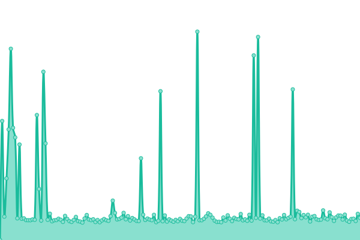

# [📈 Live Status](https://oklabflensburg.github.io/open-health-check): <!--live status--> **🟧 Partial outage**

This repository contains the open-source uptime monitor and status page for [OK Lab Flensburg](https://oklabflensburg.de), powered by [Upptime](https://github.com/upptime/upptime).

With [Upptime](https://upptime.js.org), you can get your own unlimited and free uptime monitor and status page, powered entirely by a GitHub repository. We use [Issues](https://github.com/oklabflensburg/open-health-check/issues) as incident reports, [Actions](https://github.com/oklabflensburg/open-health-check/actions) as uptime monitors, and [Pages](https://oklabflensburg.github.io/open-health-check) for the status page.

<!--start: status pages-->
<!-- This summary is generated by Upptime (https://github.com/upptime/upptime) -->
<!-- Do not edit this manually, your changes will be overwritten -->
<!-- prettier-ignore -->
| URL | Status | History | Response Time | Uptime |
| --- | ------ | ------- | ------------- | ------ |
|  [Open Data Day Flensburg](https://opendataday-flensburg.de) | 🟩 Up | [open-data-day-flensburg.yml](https://github.com/oklabflensburg/open-health-check/commits/HEAD/history/open-data-day-flensburg.yml) | 

 518ms
     
 | 

<a href="https://status.oklabflensburg.de/history/open-data-day-flensburg">100.00%</a>
    

|  [Kitafinder Flensburg](https://kitas-in-flensburg.de) | 🟩 Up | [kitafinder-flensburg.yml](https://github.com/oklabflensburg/open-health-check/commits/HEAD/history/kitafinder-flensburg.yml) | 

 410ms
     
 | 

<a href="https://status.oklabflensburg.de/history/kitafinder-flensburg">100.00%</a>
    

|  [Baumkataster Flensburg](https://baumkataster-flensburg.de) | 🟩 Up | [baumkataster-flensburg.yml](https://github.com/oklabflensburg/open-health-check/commits/HEAD/history/baumkataster-flensburg.yml) | 

 406ms
     
 | 

<a href="https://status.oklabflensburg.de/history/baumkataster-flensburg">100.00%</a>
    

|  [Denkmalschutzliste Flensburg](https://denkmalschutz-flensburg.de) | 🟩 Up | [denkmalschutzliste-flensburg.yml](https://github.com/oklabflensburg/open-health-check/commits/HEAD/history/denkmalschutzliste-flensburg.yml) | 

 403ms
     
 | 

<a href="https://status.oklabflensburg.de/history/denkmalschutzliste-flensburg">100.00%</a>
    

|  [Spielplatzkarte Flensburg](https://spielplatzkarte.oklabflensburg.de) | 🟩 Up | [spielplatzkarte-flensburg.yml](https://github.com/oklabflensburg/open-health-check/commits/HEAD/history/spielplatzkarte-flensburg.yml) | 

 406ms
     
 | 

<a href="https://status.oklabflensburg.de/history/spielplatzkarte-flensburg">100.00%</a>
    

|  [Website des OK Lab Flensburg](https://oklabflensburg.de) | 🟩 Up | [website-des-ok-lab-flensburg.yml](https://github.com/oklabflensburg/open-health-check/commits/HEAD/history/website-des-ok-lab-flensburg.yml) | 

 994ms
     
 | 

<a href="https://status.oklabflensburg.de/history/website-des-ok-lab-flensburg">99.91%</a>
    

|  [Daten Schnittstelle des OK Lab Flensburg](https://api.oklabflensburg.de) | 🟩 Up | [daten-schnittstelle-des-ok-lab-flensburg.yml](https://github.com/oklabflensburg/open-health-check/commits/HEAD/history/daten-schnittstelle-des-ok-lab-flensburg.yml) | 

 523ms
     
 | 

<a href="https://status.oklabflensburg.de/history/daten-schnittstelle-des-ok-lab-flensburg">100.00%</a>
    

|  [Schulen in Flensburg](https://schulen-in-flensburg.de) | 🟩 Up | [schulen-in-flensburg.yml](https://github.com/oklabflensburg/open-health-check/commits/HEAD/history/schulen-in-flensburg.yml) | 

 0ms
     
 | 

<a href="https://status.oklabflensburg.de/history/schulen-in-flensburg">100.00%</a>
    

|  [Bodennutzungskarte Deutschland](https://bodennutzung.oklabflensburg.de) | 🟩 Up | [bodennutzungskarte-deutschland.yml](https://github.com/oklabflensburg/open-health-check/commits/HEAD/history/bodennutzungskarte-deutschland.yml) | 

 426ms
     
 | 

<a href="https://status.oklabflensburg.de/history/bodennutzungskarte-deutschland">100.00%</a>
    

|  [Nahverkehrskarte Flensburg](https://nahverkehr-flensburg.de) | 🟥 Down | [nahverkehrskarte-flensburg.yml](https://github.com/oklabflensburg/open-health-check/commits/HEAD/history/nahverkehrskarte-flensburg.yml) | 

 0ms
     
 | 

<a href="https://status.oklabflensburg.de/history/nahverkehrskarte-flensburg">0.00%</a>
    

|  [Recycling Standortkarte Flensburg](https://recycling.oklabflensburg.de) | 🟩 Up | [recycling-standortkarte-flensburg.yml](https://github.com/oklabflensburg/open-health-check/commits/HEAD/history/recycling-standortkarte-flensburg.yml) | 

 387ms
     
 | 

<a href="https://status.oklabflensburg.de/history/recycling-standortkarte-flensburg">100.00%</a>
    

|  [Sozialatlas Dashboard Flensburg](https://sozialatlas.oklabflensburg.de) | 🟩 Up | [sozialatlas-dashboard-flensburg.yml](https://github.com/oklabflensburg/open-health-check/commits/HEAD/history/sozialatlas-dashboard-flensburg.yml) | 

 394ms
     
 | 

<a href="https://status.oklabflensburg.de/history/sozialatlas-dashboard-flensburg">100.00%</a>
    

|  [Sozialatlas Dashboard Flensburg (Beta)](https://dev.sozialatlas.oklabflensburg.de) | 🟩 Up | [sozialatlas-dashboard-flensburg-beta.yml](https://github.com/oklabflensburg/open-health-check/commits/HEAD/history/sozialatlas-dashboard-flensburg-beta.yml) | 

 375ms
     
 | 

<a href="https://status.oklabflensburg.de/history/sozialatlas-dashboard-flensburg-beta">100.00%</a>
    

|  [Website OK Lab Flensburg (Beta)](https://website.oklabflensburg.de) | 🟩 Up | [website-ok-lab-flensburg-beta.yml](https://github.com/oklabflensburg/open-health-check/commits/HEAD/history/website-ok-lab-flensburg-beta.yml) | 

 1023ms
     
 | 

<a href="https://status.oklabflensburg.de/history/website-ok-lab-flensburg-beta">99.90%</a>
    

|  [Unfallkarte Flensburg](https://unfallkarte.oklabflensburg.de) | 🟩 Up | [unfallkarte-flensburg.yml](https://github.com/oklabflensburg/open-health-check/commits/HEAD/history/unfallkarte-flensburg.yml) | 

 371ms
     
 | 

<a href="https://status.oklabflensburg.de/history/unfallkarte-flensburg">100.00%</a>
    

|  [Daten Schnittstelle Unfallkarte Flensburg](https://api.oklabflensburg.de/accidents/v1/details) | 🟥 Down | [daten-schnittstelle-unfallkarte-flensburg.yml](https://github.com/oklabflensburg/open-health-check/commits/HEAD/history/daten-schnittstelle-unfallkarte-flensburg.yml) | 

 318ms
     
 | 

<a href="https://status.oklabflensburg.de/history/daten-schnittstelle-unfallkarte-flensburg">0.00%</a>
    

|  [Sozialatlas Dashboard Flensburg (Alpha)](https://dev.sozialatlas-flensburg.de) | 🟥 Down | [sozialatlas-dashboard-flensburg-alpha.yml](https://github.com/oklabflensburg/open-health-check/commits/HEAD/history/sozialatlas-dashboard-flensburg-alpha.yml) | 

 0ms
     
 | 

<a href="https://status.oklabflensburg.de/history/sozialatlas-dashboard-flensburg-alpha">0.00%</a>
    

<!--end: status pages-->

[**Visit our status website →**](https://oklabflensburg.github.io/open-health-check)

## 📄 License

- Powered by: [Upptime](https://github.com/upptime/upptime)
- Code: [MIT](./LICENSE) © [OK Lab Flensburg](https://oklabflensburg.de)
- Data in the `./history` directory: [Open Database License](https://opendatacommons.org/licenses/odbl/1-0/)
